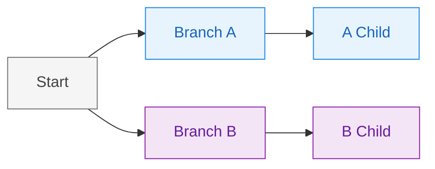

# Figma Diagram Design

Apply hierarchy-based color theming to diagrams. Each top-level branch gets a distinct color; all descendants inherit that color, creating instant visual grouping.

## Color Application Rules

1. **Identify top-level branches** — nodes directly connected to the root/start
2. **Assign distinct colors** — one color per top-level branch from the palette
3. **Inherit downward** — all child nodes match their ancestor's branch color
4. **Root stays neutral** — use the neutral color for entry points and shared nodes

## Mermaid Styling Syntax

Define classes and apply them to nodes:



## Curated Palettes

### Modern Professional (Default)
| Branch | Fill | Stroke | Text |
|--------|------|--------|------|
| 1 - Blue | #E8F4FD | #1E88E5 | #1565C0 |
| 2 - Purple | #F3E5F5 | #8E24AA | #6A1B9A |
| 3 - Green | #E8F5E9 | #43A047 | #2E7D32 |
| 4 - Orange | #FFF3E0 | #FB8C00 | #E65100 |
| 5 - Teal | #E0F2F1 | #00897B | #00695C |
| 6 - Red | #FFEBEE | #E53935 | #C62828 |
| Neutral | #F5F5F5 | #757575 | #424242 |

### Soft Pastel
| Branch | Fill | Stroke | Text |
|--------|------|--------|------|
| 1 - Rose | #FCE4EC | #F06292 | #C2185B |
| 2 - Sky | #E1F5FE | #4FC3F7 | #0277BD |
| 3 - Mint | #E0F7FA | #4DD0E1 | #00838F |
| 4 - Peach | #FFF8E1 | #FFD54F | #F57F17 |
| 5 - Lavender | #EDE7F6 | #B39DDB | #5E35B1 |
| 6 - Sage | #F1F8E9 | #AED581 | #558B2F |
| Neutral | #FAFAFA | #BDBDBD | #616161 |

### Bold Vibrant
| Branch | Fill | Stroke | Text |
|--------|------|--------|------|
| 1 - Electric Blue | #BBDEFB | #2196F3 | #0D47A1 |
| 2 - Hot Pink | #F8BBD9 | #E91E63 | #880E4F |
| 3 - Lime | #DCEDC8 | #8BC34A | #33691E |
| 4 - Amber | #FFECB3 | #FFC107 | #FF6F00 |
| 5 - Deep Purple | #D1C4E9 | #673AB7 | #311B92 |
| 6 - Cyan | #B2EBF2 | #00BCD4 | #006064 |
| Neutral | #ECEFF1 | #607D8B | #37474F |

## Workflow

1. Parse the diagram structure to identify hierarchy
2. Count top-level branches and select palette
3. Generate classDef statements for each branch + neutral
4. Apply classes to all nodes based on their branch ancestry
5. Ensure root/shared nodes use neutral styling

## Presenting Diagram URLs

Terminal display can corrupt long Figma URLs when copied. Follow these rules:

### URL Presentation Rules

1. **Provide the diagram ID separately** — on its own line
2. **Use short URL form** — omit `https://` to reduce length
3. **Never use markdown links** — `[text](url)` can cause double-prefix issues
4. **Avoid query parameters** — they add unnecessary length

### Recommended Format

```
**Diagram ID:** b201b3c8-b2ab-4ed9-a3bc-7e09703db246

**Access your diagram at:**
figma.com/online-whiteboard/create-diagram/ + the ID above
```

### If User Reports 404 Error

1. Check for `%0A` or `%20` in their URL (indicates line break corruption)
2. Provide the diagram ID separately
3. Have them manually construct the short URL

## Notes

- For diagrams with >6 branches, cycle through the palette or select a subset
- Gantt charts: color by task group/section rather than hierarchy
- Sequence diagrams: color by participant/actor
- State diagrams: color by state category or region
